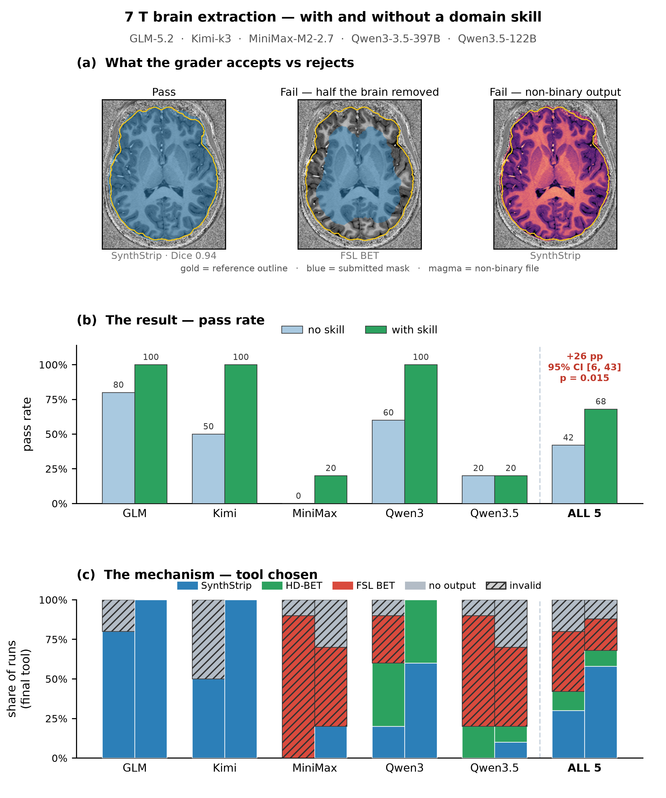

# Benchmark reporting

Turns the grading harness's **durable outputs** into human-facing, **self-contained HTML** — a
per-task report and a cross-task leaderboard. Nothing here re-grades or needs the raw run data; it
consumes only the small records the harness already emits (`summary.json`, `runs.csv`), so it works
long after the execution environment (and its NIfTIs) are gone.

```
 grading harness  ──►  summary.json + runs.csv  ──►  build_report.py  ──►  report_<task>.html
 (benchmark/harness)   (+ optional rubric,             build_index.py   ──►  index.html
                         figures, QC thumbnails)
```

Two tiers, both static and self-contained (every asset inlined as base64 — no server, no external
request), so the whole thing is one folder you can open locally, upload as a CI artifact, or publish
to GitHub Pages:

```
index.html            ← overview: task × model pass-rate grid
      │  click a task
      ▼
report_<task>.html    ← one task: scoring card, leaderboard, figures, per-run table, (optional) QC gallery
```

## Usage

Per-task report:

```bash
python build_report.py \
  --summary path/to/summary.json \
  --runs    path/to/runs.csv \
  --rubric  ../graders/structural-brain-extraction-7t/rubric.json  \  # optional: scoring card
  --figure  analysis.png  [--figure more.png ...]                  \  # optional: embedded figures
  --thumbs  qc/                                                    \  # optional: per-run QC PNG gallery
  --title   "7T brain extraction" \
  --out     report.html
```

Leaderboard index (one `--entry` per task; `REPORT_HREF` may be a relative path or a URL, or `''`):

```bash
python build_index.py \
  --entry "Brain extraction — 7T" brain-extraction-7t/summary.json brain-extraction-7t/report.html \
  --entry "Tissue segmentation — 7T" tissue-seg-7t/summary.json tissue-seg-7t/report.html \
  --out index.html
```

Only `numpy`-free stdlib is used (`json`, `csv`, `base64`, `html`) — no dependencies.

## Expected input schema

`summary.json` (per the harness):

```jsonc
{
  "task": "structural-brain-extraction-7t",
  "n_runs": 100,
  "provenance": { "image_version": {...}, "opencode_version": {...},
                  "skills_sha": {...}, "tasks_sha": {...} },
  "poolable": true,
  "cells": { "<model>|<arm>": { "n": 10, "passes": 8, "mean": 79.7, "sd": 42.0,
                                "uptake": 0, "not_found_claims": 9, "methods": {"synthstrip": 8} } },
  "skill_effect": { "<model>": { "delta_pp": 20, "ci95_pp": [-11, 51], "fisher_p": 0.47 } }
}
```

`runs.csv` needs at least `model, arm, verdict, score, dice, passed` (extra columns are ignored).
The scoring card is rendered from the grader pack's `rubric.json` (`gates`, `weights`,
`verdict_thresholds`, `prompt`) when `--rubric` is given.

Arm labels `env-only` / `env+skill` (and `baseline` / `skill`) render as **no skill** / **with skill**.

## Example

`examples/` is a worked example and is safe to delete (`git rm -r examples/`) — the tools do not
depend on it.



- `examples/brain-extraction-7t/{summary.json,runs.csv,figure.png}` — a 100-run headless sweep
  (5 open-weight models × 2 conditions × 10) on `structural-brain-extraction-7t`, run on Neurodesk
  Play. **Data courtesy of the benchmark-runner sweep; provenance is recorded inside `summary.json`
  (image, opencode, skills/task SHAs).**
- `examples/brain-extraction-7t/report.html` and `examples/index.html` — generated by the commands
  above.

## Notes

- **Self-contained** = no external hosts. A strict environment (CI artifact viewer, GitHub Pages)
  renders it with no network access.
- **Portable** = paths come from CLI args; nothing is hardcoded.
- The QC gallery is **optional**: pass `--thumbs DIR` of per-run PNGs (rendered on the grading plane
  before the environment is torn down). Without it, the report simply omits the gallery.
- This layer only *reads* grading outputs; the grader itself is `../harness/grade_wrapper.py`.
